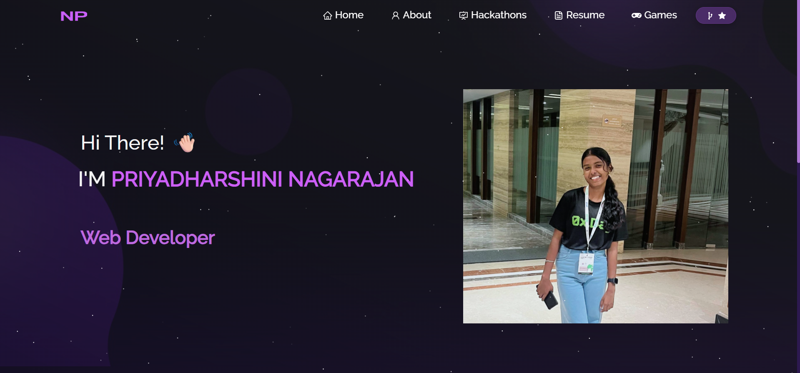

<h2 align="center">
  Portfolio Website - v1.0<br/>
  <a href="https://priya06-portfolio.vercel.app/" target="_blank">Live Demo</a>
</h2>

<div align="center">
  
</div>

<br/>

<center>

[](https://forthebadge.com) &nbsp;
[](https://forthebadge.com) &nbsp;
[](https://forthebadge.com) &nbsp;
 &nbsp;


</center>

<h3 align="center">
    🔹
    <a href="https://github.com/Priyanagarajan06/Portfolio/issues">Report Bug</a> &nbsp; &nbsp;
    🔹
    <a href="https://github.com/Priyanagarajan06/Portfolio/issues">Request Feature</a>
</h3>

---

## 🚀 TL;DR
You can fork this repo to modify and make changes of your own. Please give me proper credit by linking back to [Priyanagarajan06](https://github.com/Priyanagarajan06). Thanks! 🙌

---

## 🛠️ Built With

My personal portfolio [Live Demo](https://priya06-portfolio.vercel.app/) which showcases my **projects, resume, and technical skills**.  

This project was built using these technologies:

- React.js
- Node.js
- CSS3
- Git & GitHub
- VsCode
- Vercel (Deployment)

---

## ✨ Features

**📖 Multi-Page Layout**  
**🎨 Styled with custom CSS / Bootstrap**  
**📱 Fully Responsive Design**  

---

## 🚀 Getting Started

Clone down this repository. You will need `node.js` and `git` installed globally on your machine.

### Installation and Setup Instructions

1. Clone repo:  
   ```bash
   git clone https://github.com/Priyanagarajan06/Portfolio.git
2. Installation: npm install 
3. In the project directory, you can run: npm start 

Runs the app in the development mode.\ Open [http://localhost:3000](http://localhost:3000) to view it in the browser. 
The page will reload if you make edits. 

## Usage Instructions 

Open the project folder and Navigate to /src/components/. <br/> You will find all the components used and you can edit your information accordingly. 


### Show your support 

Give a ⭐ if you like this website!

---

👉 You just need to:
- Replace `[https://priya06-portfolio.vercel.app/]` with your actual **Vercel live link**.  
- Update the screenshot path (`./Images/readme-img.png`) if you want to show a demo image of your site.  

Would you like me to also **design a demo screenshot template** (like a nice preview image of your portfolio) that you can put in your README?

this is okayy 
